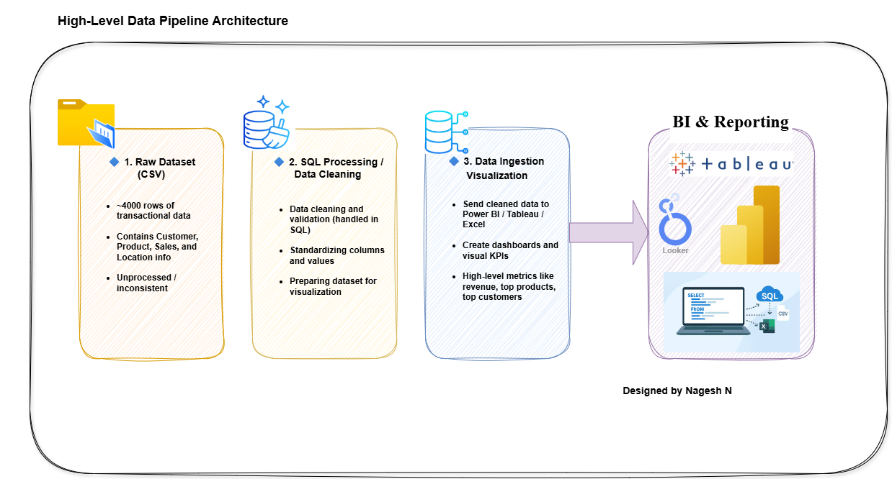

# Sales Analysis Project

## Objective
Clean and analyze a sales dataset using SQL in MySQL.  
Focus: Customer behavior, sales performance, product revenue, and discount analysis.

## Dataset
- Raw CSV: `data/sales.csv`
- Imported directly into MySQL for analysis.
- Small-sized dataset, suitable for practice and learning SQL.

## Project Structure
Sales_Analysis/
├─ data/           # Raw CSV dataset
├─ scripts/        # SQL scripts for cleaning and analysis
│   └─ sales_analysis.sql
├─ docs/           # Diagrams
│   └─ architecture.png
└─ README.md       # Project overview

## Analysis Steps
1. Remove duplicate CustomerIDs (keep highest Sales per customer)  
2. Trim unwanted spaces in CustomerName  
3. Top 10 customers by NetSales  
4. Customer segmentation (High/Medium/Low value)  
5. Count customers in each segment  
6. Discounts analysis (per customer)  
7. Top products by revenue  

## Diagram

## Notes
- Cleaned data is generated in MySQL using the `sales_cleaned` table.  
- SQL script handles all cleaning and analysis automatically.  
- The project is small in scale but demonstrates **basic SQL data cleaning and analysis workflows**.
